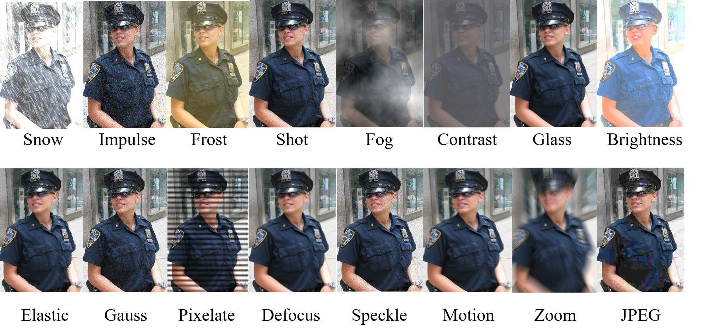
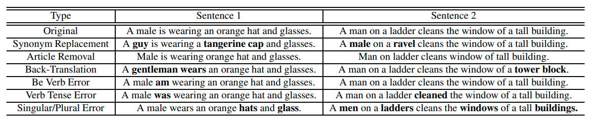

# Semantic-Preserving Augmentation For Robust Image-Text Retrieval

Image and text corruption datasets of the paper **Semantic-Preserving Augmentation For Robust Image-Text Retrieval** 
https://ieeexplore.ieee.org/abstract/document/10096661 (**ICASSP 2023**). Please cite this paper if you are using any resources from the repo.

Please download image corruption datasets using the following link:
https://www.dropbox.com/sh/2ndp2q54m95ojpk/AABNGc7QE6nEHh4ZFrs-qckKa?dl=0

## Semantic-Preserving Image Augmentations

## Semantic-Preserving Text Augmentations

